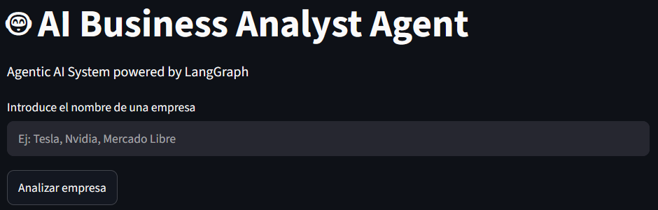
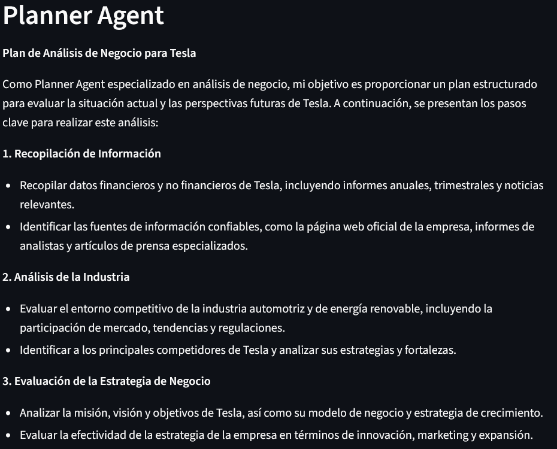
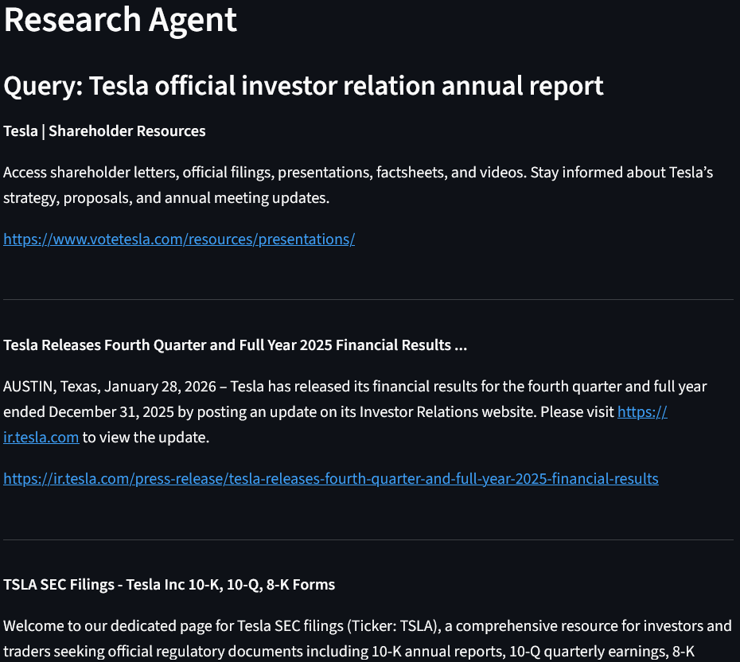
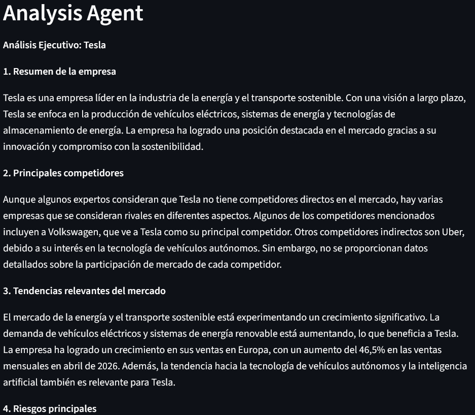
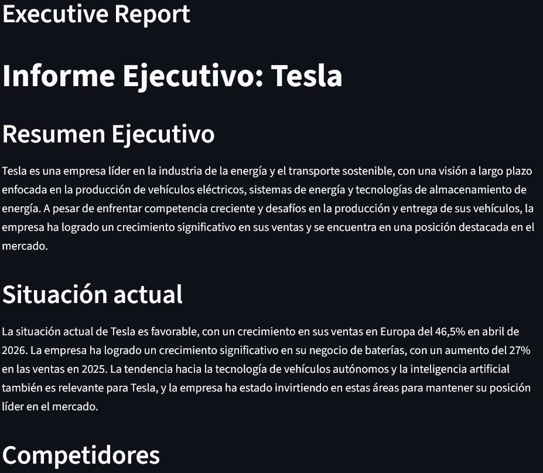

# AI Business Analyst Agent (LangGraph)

Mini Agentic AI project developed to demonstrate a modular workflow of specialized agents applied to business analysis.

## Objective

The objective of this project is to automate the initial research and analysis process of a company.
The system receives the name of a company and generates an executive report containing:

* Company overview
* Competitors
* Risks
* Opportunities
* Strategic recommendations

## Architecture

The system follows a modular agent-based architecture:

```text

User
↓
Streamlit UI
↓
Planner Node
↓
Research Node
↓
Analysis Node
↓
Report Node
↓
Executive Report
```
A graphical representation of the architecture can be found in `Arquitectura.pdf`.

## Agents

The project consists of four agents:

### Planner Agent

Generates an analysis plan for the selected company.

### Research Agent

Retrieves external information using DuckDuckGo Search.

### Analysis Agent

Synthesizes the collected information and generates business insights.

### Report Agent

Transforms the analysis into a professional executive report.

## Technologies

* Python
* Streamlit
* Groq API
* DuckDuckGo Search
* python-dotenv
* LangGraph

## Why Streamlit?

Streamlit was chosen because it enables the rapid development of interactive applications using Python.
This allows the project to focus on the agentic architecture rather than frontend development.

## Why DuckDuckGo Search?

DuckDuckGo Search was chosen because it provides a lightweight and free search tool that can be easily integrated into the Research Agent.
The architecture is modular, allowing the search tool to be replaced according to the user's preference (Tavily, SerpAPI, Bing Search API, or other providers).

## Project Structure

```text
ai-business-analyst-agent-langgraph/
│
├── app.py
├── requirements.txt
├── .env.example
├── README.md
├── README_es.md
├── Arquitectura.pdf
│
├── screenshots/ 
│   ├── 01_home.png 
│   ├── 02_planner_agent.png 
│   ├── 03_research_agent.png 
│   ├── 04_analyst_agent.png
│   └── 05_executive_report.png
│
├── agents/
│   ├── __init__.py
│   ├── analyst.py
│   ├── graph.py
│   ├── graph_nodes.py
│   ├── llm.py
│   ├── planner.py
│   ├── reporter.py
│   ├── researcher.py
│   └── state.py
│
└── tools/
         ├── __init__.py
         └── web_search.py
```

## Agentic AI Capabilities Demonstrated

* Planning
* Tool Use
* Multi-step Reasoning
* Modular Architecture
* Executive Report Generation
* Separation of Responsibilities

## Screenshots

The following screenshots show excerpts of the output generated by each agent. Full outputs are longer and have been truncated for readability.

### Home Screen


### Planner Agent

Example of the analysis plan generated for the selected company.

*The screenshot shows an excerpt of the generated plan.*



### Research Agent

Example of external information retrieved using DuckDuckGo Search.

*The screenshot shows an excerpt of the retrieved results.*



### Analysis Agent

Example of the business insights generated from the collected information.

*The screenshot shows an excerpt of the generated analysis.*



### Executive Report

Example of the final executive report delivered to the user.

*The screenshot shows an excerpt of the generated report.*



## Installation (Windows)

Create a virtual environment:

```bash
python -m venv venv
```

Activate the virtual environment:

```bash
venv\Scripts\activate
```

Install dependencies:

```bash
pip install -r requirements.txt
```

Environment variables:

Create a `.env` file based on `.env.example`:

```env
GROQ_API_KEY=your_api_key_here
```

## Execution

```bash
streamlit run app.py
```

## Example Usage

Input:
```text
Tesla
```

Output:
```text
Executive report including company overview, competitors, risks, opportunities, and strategic recommendations.
```

## Limitations

* DuckDuckGo Search may return repeated or incomplete results.
* The analysis depends on the quality of the retrieved sources.
* Persistent memory is not currently implemented.
* Financial data is not automatically validated against official sources.
* The current prompts are optimized for Spanish output.

## Future Improvements

* Add multilingual support.
* Add persistent memory.
* Improve source ranking and filtering.
* Export reports to PDF.
* Add Human-in-the-loop validation.
* Replace DuckDuckGo Search with Tavily or another search engine optimized for Agentic AI applications.

## Author

David E. León Loza – B.Eng. Mechatronics Engineering
